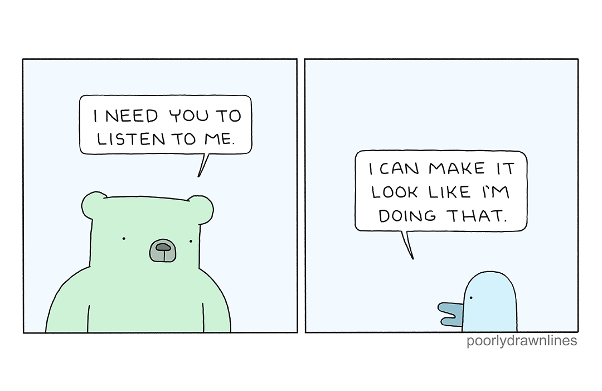

class: center, middle, inverse

# betadots GmbH

## @rwaffen

##### -

# How to migrate your

# Puppet [Enterprise] CA

# to OpenVox

[](https://cfgmgmtcamp.org)
.div.lizenzblock[[CC BY-NC-SA 4.0](https://creativecommons.org/licenses/by-nc-sa/4.0/)]

???

* Use `???` to add notes
* Use `---` to separate slides
* Use `count: false` to disable slide numbering
* Use `background-image: url(image.png)` to set a background image

---

## $ whoami


* Robert Waffen

* Señor Agile Enterprise DevOps

* @rwaffen on GitHub

* Puppet Contributor since ~2013

* Merging stuff at [Vox Pupuli](https://voxpupuli.org/) (Puppet Community) since ~2021

* Senior IT Automation Consultant at [betadots](https://betadots.de/)

* Vox Pupuli Project Management Committee member

* Consultant for Puppet Enterprise, Puppet Core and OpenVox

* The container guy at betadots and in the Puppet Community

[](https://betadots.de)
[](https://cfgmgmtcamp.org)
.div.lizenzblock[[CC BY-NC-SA 4.0](https://creativecommons.org/licenses/by-nc-sa/4.0/)]

???

* who has seen this picture before because I reviewed/merged your pull request?

---

## $ ls -la slides/*

[](https://poorlydrawnlines.com/comic/listen-to-me/)

* Why migrate?

* How to migrate?

* Q&A

[](https://betadots.de)
[](https://cfgmgmtcamp.org)
.div.lizenzblock[[CC BY-NC-SA 4.0](https://creativecommons.org/licenses/by-nc-sa/4.0/)]

???

---

## Why migrate? v1

* Puppet OSS is discontinued

  * OpenVox is the new Open Source Puppet
  * OpenVox is a fork of Puppet OSS and compatible with Puppet Core / Enterprise (as of now)
  * OpenVox is community driven and actively maintained

[](https://betadots.de)
[](https://cfgmgmtcamp.org)
.div.lizenzblock[[CC BY-NC-SA 4.0](https://creativecommons.org/licenses/by-nc-sa/4.0/)]

???

---

## Why migrate? v2

* Puppet Enterprise is maybe too expensive for you

  * OpenVox is free to use
  * OpenVox can be used as a replacement for Puppet Enterprise
  * Here you also can use Foreman

[](https://betadots.de)
[](https://cfgmgmtcamp.org)
.div.lizenzblock[[CC BY-NC-SA 4.0](https://creativecommons.org/licenses/by-nc-sa/4.0/)]

???

---

## Why migrate? v3

* If you have a running Puppet CA and lots of agents you might not want to resign all certificates

  * Migrating the Puppet CA to OpenVox allows you to keep your existing certificates
  * No need to reconfigure all your Puppet Agents
  * But you should switch to OpenVox Agent eventually
      * which is an drop-in replacement for Puppet Agent

[](https://betadots.de)
[](https://cfgmgmtcamp.org)
.div.lizenzblock[[CC BY-NC-SA 4.0](https://creativecommons.org/licenses/by-nc-sa/4.0/)]

???

---

## Why migrate? v4

* But what is the Puppet CA?

  * It's a simple SSL Certificate Authority (wrapped in Jruby/Ruby)
  * So it's only files on disk
  * That means we should be able to just copy them over to OpenVox

[](https://betadots.de)
[](https://cfgmgmtcamp.org)
.div.lizenzblock[[CC BY-NC-SA 4.0](https://creativecommons.org/licenses/by-nc-sa/4.0/)]

???

---

## Why migrate? v5

* The copy cannot run in parallel

  * Because both Puppet CA and OpenVox CA would issue certificates with the same serial numbers
  * There is no synchronization mechanism between both CAs

* So when you migrate you should discontinue the use of Puppet CA

[](https://betadots.de)
[](https://cfgmgmtcamp.org)
.div.lizenzblock[[CC BY-NC-SA 4.0](https://creativecommons.org/licenses/by-nc-sa/4.0/)]

???

---

## How to migrate? v1

```bash
ssh puppet.example.com

# Stop puppetserver to prevent new certificates from being issued
systemctl stop puppetserver || systemctl stop pe-puppetserver

# Generate a certificate for the new server with also the old server's FQDN
puppetserver ca generate \
  --certname openvox.example.com \
  --subject-alt-names puppet,puppet.example.com,openvox,openvox.example.com \
  --ca-client
```

[](https://betadots.de)
[](https://cfgmgmtcamp.org)
.div.lizenzblock[[CC BY-NC-SA 4.0](https://creativecommons.org/licenses/by-nc-sa/4.0/)]

???

---

## How to migrate? v2

```bash
# Create a tarball of the existing Puppet CA and SSL directories
tar cvfz ~/ca.tgz /etc/puppetlabs/puppetserver/ca /etc/puppetlabs/puppet/ssl

# As long we don't sign new certificates we can start the puppetserver again
# I wouldn't recommend to do this and just keep it stopped until the migration is done
systemctl start puppetserver || systemctl start pe-puppetserver
```

[](https://betadots.de)
[](https://cfgmgmtcamp.org)
.div.lizenzblock[[CC BY-NC-SA 4.0](https://creativecommons.org/licenses/by-nc-sa/4.0/)]

???

---

## How to migrate? v3

```bash
# get id of the puppet user to set correct ownership later
id puppet || id pe-puppet
```

[](https://betadots.de)
[](https://cfgmgmtcamp.org)
.div.lizenzblock[[CC BY-NC-SA 4.0](https://creativecommons.org/licenses/by-nc-sa/4.0/)]

???

---

## How to migrate? v4

```bash
# transfer the tarball to the new OpenVox server
scp puppet.example.com:ca.tgz .
scp ca.tgz openvox.example.com:/

# or
scp puppet.example.com:ca.tgz openvox.example.com:/

# or
scp ~/ca.tgz openvox.example.com:/

# just somehow get the file onto the new server
```

[](https://betadots.de)
[](https://cfgmgmtcamp.org)
.div.lizenzblock[[CC BY-NC-SA 4.0](https://creativecommons.org/licenses/by-nc-sa/4.0/)]

???

---

## How to migrate? v5

```bash
# install OpenVox
ssh openvox.example.com
dnf install -y https://yum.voxpupuli.org/openvox8-release-el-9.noarch.rpm
dnf install -y openvox-agent openvox-server
```

[](https://betadots.de)
[](https://cfgmgmtcamp.org)
.div.lizenzblock[[CC BY-NC-SA 4.0](https://creativecommons.org/licenses/by-nc-sa/4.0/)]

???

---

## How to migrate? v6

```bash
# extract the tarball to restore the Puppet CA and SSL directories
cd /
tar xvfz ca.tgz

# set correct ownership of the restored files
# use the puppet user and group ids from the Puppet server
# puppet osp and pe-puppet use different ids
find /etc/puppetlabs/ -user 993 -exec chown puppet {} +
find /etc/puppetlabs/ -group 992 -exec chgrp puppet {} +
```

[](https://betadots.de)
[](https://cfgmgmtcamp.org)
.div.lizenzblock[[CC BY-NC-SA 4.0](https://creativecommons.org/licenses/by-nc-sa/4.0/)]

???

---

## How to migrate? v7

```bash
# start OpenVox server
systemctl start openvox-server

# on any agent
puppet-agent --test --server openvox.example.com
```

[](https://betadots.de)
[](https://cfgmgmtcamp.org)
.div.lizenzblock[[CC BY-NC-SA 4.0](https://creativecommons.org/licenses/by-nc-sa/4.0/)]

???

---

## How to migrate? v8

Final thoughts:

* Maybe also migrate the old IP and/or hostname to the new server
  * So agents don't need to be reconfigured
  * No DNS trickery or load balancer in front of both servers

* Cross-sign the CAs if you want to run both in parallel for some time
  * <https://github.com/voxpupuli/puppet-puppet_ca_utils>
  * Don't ask me, Tim said this is possible :D

[](https://betadots.de)
[](https://cfgmgmtcamp.org)
.div.lizenzblock[[CC BY-NC-SA 4.0](https://creativecommons.org/licenses/by-nc-sa/4.0/)]

???

---

# Demo Time!

[](https://betadots.de)
[](https://cfgmgmtcamp.org)
.div.lizenzblock[[CC BY-NC-SA 4.0](https://creativecommons.org/licenses/by-nc-sa/4.0/)]

???

---

# Q&A

[](https://betadots.de)
[](https://cfgmgmtcamp.org)
.div.lizenzblock[[CC BY-NC-SA 4.0](https://creativecommons.org/licenses/by-nc-sa/4.0/)]

???

---

# Thank You!

[](https://betadots.de)
[](https://cfgmgmtcamp.org)
.div.lizenzblock[[CC BY-NC-SA 4.0](https://creativecommons.org/licenses/by-nc-sa/4.0/)]

???
