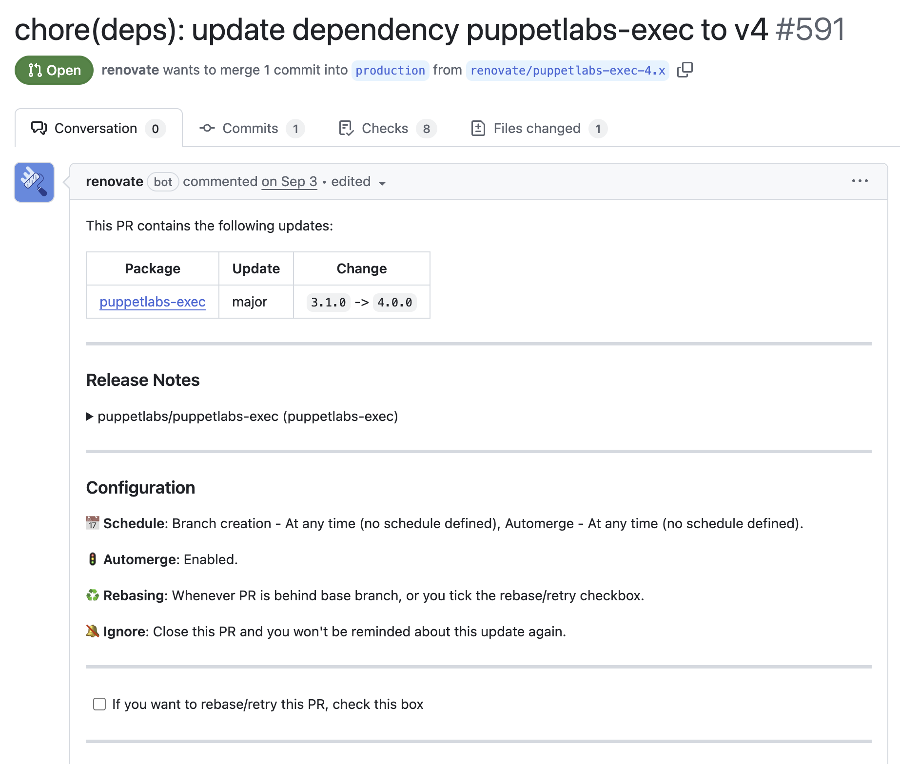

class: center, middle, inverse

# betadots GmbH

## @rwaffen

###### -

# Using Containers

# in OpenVox Environments

[](https://cfgmgmtcamp.org)
.div.lizenzblock[[CC BY-NC-SA 4.0](https://creativecommons.org/licenses/by-nc-sa/4.0/)]

---

class: center, middle, inverse

# betadots GmbH

## @rwaffen

###### -

# Using Containers

# in Puppet Environments

[](https://puppet.run)
.div.lizenzblock[[CC BY-NC-SA 4.0](https://creativecommons.org/licenses/by-nc-sa/4.0/)]

---

class: center, middle, inverse

# betadots GmbH

## @rwaffen

###### -

# Using Containers

# in OpenVox Environments

[](https://cfgmgmtcamp.org)
.div.lizenzblock[[CC BY-NC-SA 4.0](https://creativecommons.org/licenses/by-nc-sa/4.0/)]

???

* Use `???` to add notes
* Use `---` to separate slides
* Use `count: false` to disable slide numbering
* Use `background-image: url(image.png)` to set a background image

---

## $ whoami


* Robert Waffen

* Señor Agile Enterprise DevOps

* @rwaffen on GitHub

* Vox Pupuli Contributor since ~2013

* Merging stuff at [Vox Pupuli](https://voxpupuli.org/) (Puppet Community) since 2022

* Senior IT Automation Consultant at [betadots](https://betadots.de/)

* Vox Pupuli Project Management Committee member

* Consultant for OpenVox, Puppet Enterprise, Puppet Core ... You name it!

* The container guy at betadots and in the Vox Pupuli Community

[](https://betadots.de)
[](https://cfgmgmtcamp.org)
.div.lizenzblock[[CC BY-NC-SA 4.0](https://creativecommons.org/licenses/by-nc-sa/4.0/)]

???

* who has seen this picture before because I reviewed/merged your pull request?

---

## $ ls -la slides/*

[](https://poorlydrawnlines.com/comic/listen-to-me/)

* [container-commitlint](https://github.com/voxpupuli/container-commitlint)

* [container-semantic-release](https://github.com/voxpupuli/container-semantic-release)

* [container-renovate](https://github.com/voxpupuli/container-renovate)

* [container-openvoxserver](https://github.com/openvoxproject/container-openvoxserver)

* [container-openvoxdb](https://github.com/openvoxproject/container-openvoxdb)

* [container-r10k](https://github.com/voxpupuli/container-r10k)

* [container-r10k-webhook](https://github.com/voxpupuli/container-r10k-webhook)

* [container-voxbox](https://github.com/voxpupuli/container-voxbox)

[](https://betadots.de)
[](https://cfgmgmtcamp.org)
.div.lizenzblock[[CC BY-NC-SA 4.0](https://creativecommons.org/licenses/by-nc-sa/4.0/)]

---

## commitlint

* This container encapsulates commitlint and all necessary plugins

* It can be used to check if all commit messages follow a defined convention

  * <https://www.conventionalcommits.org/en/v1.0.0/>

* Primarily used in CI/CD pipelines

.columns[
.column[

```shell
<type>[optional scope]: <description>

[optional body]

[optional footer(s)]
```

]
.column[

```shell
$ podman run -it --rm -v $PWD:/data ghcr.io/voxpupuli/commitlint:latest

⧗   input: 2025 rwaffen cfgmgmtcamp: add slides for using containers in OpenVox environments
✖   subject may not be empty [subject-empty]
✖   type may not be empty [type-empty]

✖   found 2 problems, 0 warnings
```

]
]

* see: <https://github.com/voxpupuli/container-commitlint>

[](https://betadots.de)
[](https://cfgmgmtcamp.org)
.div.lizenzblock[[CC BY-NC-SA 4.0](https://creativecommons.org/licenses/by-nc-sa/4.0/)]

---

## semantic-release

* This container encapsulates semantic-release and all necessary dependencies

* It can be used to automate the versioning and package publishing process

* It analyzes commit messages to determine the type of version bump (major, minor, patch)

    * it uses semver and conventional commits - see: <https://semver.org/> and <https://www.conventionalcommits.org/en/v1.0.0/>

* It generates a changelog and publishes new versions to package registries

* It also sets git tags for new releases automatically

* It can run several plugins before and after the release process

* It is designed to be used in CI/CD pipelines

* see: <https://github.com/voxpupuli/container-semantic-release>

[](https://betadots.de)
[](https://cfgmgmtcamp.org)
.div.lizenzblock[[CC BY-NC-SA 4.0](https://creativecommons.org/licenses/by-nc-sa/4.0/)]

---

## renovate



* This container encapsulates renovate and all necessary dependencies

* It can be used to automatically update dependencies in your projects

* It supports various package managers and can be configured to your needs

* Run it in CI/CD pipelines or as a standalone service

* IT opens pull requests with updated dependencies automatically

```shell
$ podman run \
  -e LOG_LEVEL=debug \
  --rm \
  -v $PWD:/data:Z \
  ghcr.io/voxpupuli/renovate --platform=local --dry-run
```

* see: <https://github.com/voxpupuli/container-renovate>

[](https://betadots.de)
[](https://cfgmgmtcamp.org)
.div.lizenzblock[[CC BY-NC-SA 4.0](https://creativecommons.org/licenses/by-nc-sa/4.0/)]

---

## openvoxserver

* This container encapsulates the openvoxserver application.

* Use it to spawn fast test environments for development and testing purposes

* Use it in production to run OpenVox server instances isolated from the host system

* Use it in kubernetes to run OpenVox server instances scalable and resiliently

* Often used together with the [OpenVoxDB](https://github.com/openvoxproject/container-openvoxdb)

* For examples see [CRAFTY](https://github.com/voxpupuli/crafty/tree/main/openvox/oss)

```shell
docker compose --profile openvox up
docker compose --profile test run testing agent -t
```

[](https://betadots.de)
[](https://cfgmgmtcamp.org)
.div.lizenzblock[[CC BY-NC-SA 4.0](https://creativecommons.org/licenses/by-nc-sa/4.0/)]

---

## openvoxdb

* This container encapsulates the openvoxdb application.

* Use it to spawn fast test environments for development and testing purposes

* Use it in production to run OpenVox database instances isolated from the host system

* Use it in kubernetes to run OpenVox database instances scalable and resiliently

* Often used together with the [OpenVox server](https://github.com/openvoxproject/container-openvoxserver)

* For examples see [CRAFTY](https://github.com/voxpupuli/crafty/tree/main/openvox/oss)

```shell
docker compose --profile openvox up
docker compose --profile test run testing agent -t
```

[](https://betadots.de)
[](https://cfgmgmtcamp.org)
.div.lizenzblock[[CC BY-NC-SA 4.0](https://creativecommons.org/licenses/by-nc-sa/4.0/)]

---

## r10k

* This container encapsulates r10k and all necessary dependencies

* It can be used to deploy OpenVox code from git repositories to OpenVox Environments

* Isolate r10k in a container to avoid dependency hell on the host system

* Run r10k in kubernetes to deploy OpenVox code in a k8s deployment

```shell
$ podman run -it --rm -v $PWD:/data ghcr.io/voxpupuli/r10k:latest deploy environment -mv
```

* see: <https://github.com/voxpupuli/container-r10k>

[](https://betadots.de)
[](https://cfgmgmtcamp.org)
.div.lizenzblock[[CC BY-NC-SA 4.0](https://creativecommons.org/licenses/by-nc-sa/4.0/)]

---

## r10k-webhook

* This container encapsulates the r10k go-webhook and all necessary dependencies

* Gitlab/GitHub webhooks can be configured to notify this service on new commits

* On notification the webhook triggers r10k to deploy the changed OpenVox code

* No demo here, trust me, it works! ;-)

  * Is deployed and used in production by a customer of betadots GmbH

* see: <https://github.com/voxpupuli/container-r10k-webhook>

[](https://betadots.de)
[](https://cfgmgmtcamp.org)
.div.lizenzblock[[CC BY-NC-SA 4.0](https://creativecommons.org/licenses/by-nc-sa/4.0/)]

---

## voxbox

* This container encapsulates all Vox Pupuli testing tools and their necessary dependencies

* Ever had trouble installing ruby on your system?

* Ever had trouble installing all dependencies for module testing?

* This container has you covered!

* See it as a frozen testing environment for OpenVox modules

* Can be used in CI/CD pipelines or locally on your development machine

```shell
$ podman run -it --rm -v $PWD:/repo:Z ghcr.io/voxpupuli/voxbox:latest spec
```

* see: <https://github.com/voxpupuli/container-voxbox>

[](https://betadots.de)
[](https://cfgmgmtcamp.org)
.div.lizenzblock[[CC BY-NC-SA 4.0](https://creativecommons.org/licenses/by-nc-sa/4.0/)]

---

## voxbox tools

.columns[
.column[

### Included rubygems

* modulesync
* onceover
* openfact
* openvox
* puppet-ghostbuster
* r10k
* rubocop
* voxpupuli-acceptance
* voxpupuli-release
* voxpupuli-test
]

.column[

### Additionally included tools

* curl
* git
* gpg
* jq
* ssh-client
* yamllint
]
]

[](https://betadots.de)
[](https://cfgmgmtcamp.org)
.div.lizenzblock[[CC BY-NC-SA 4.0](https://creativecommons.org/licenses/by-nc-sa/4.0/)]

---

## questions???

* Thank you for your attention!

* Any questions?

* Find me:
  * 🙋 at the conference
  * 🐙 GitHub: [@rwaffen](https://github.com/rwaffen)
  * 💌 Email: <rw@betadots.de>
  * 🦣 fosstodon: [@rwaffen](https://fosstodon.org/@rwaffen)

[](https://betadots.de)
[](https://cfgmgmtcamp.org)
.div.lizenzblock[[CC BY-NC-SA 4.0](https://creativecommons.org/licenses/by-nc-sa/4.0/)]
