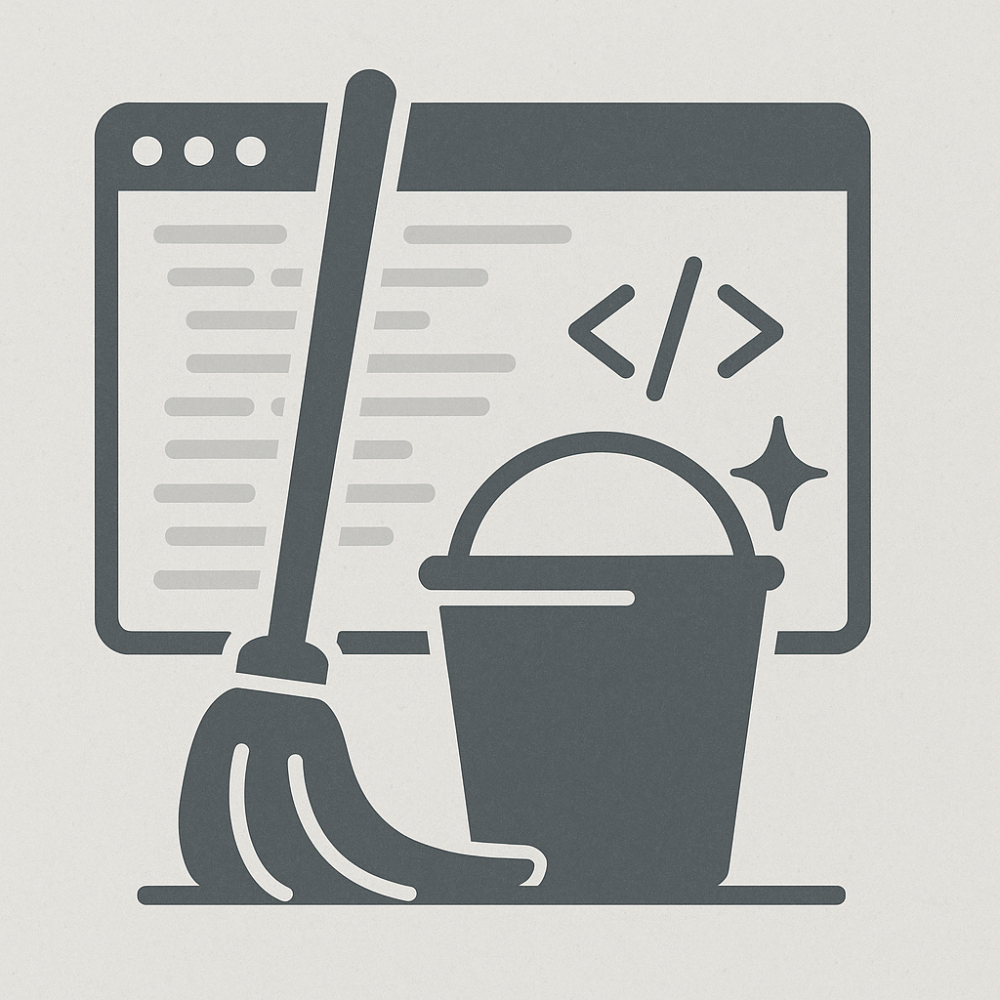
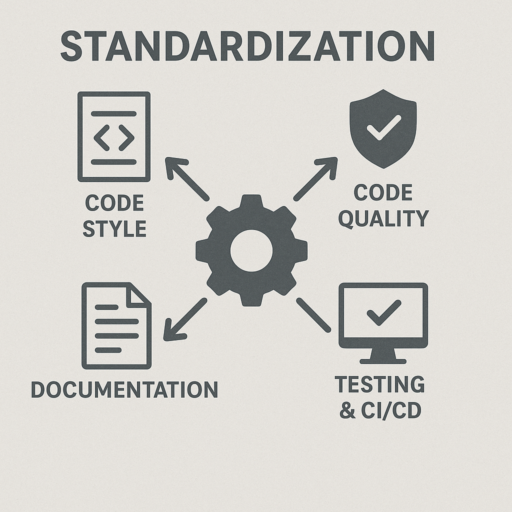

class: center, middle, inverse

# betadots GmbH - @rwaffen

#### .

# Why clean code matters?

???

* Use `???` to add notes
* Use `---` to separate slides
* Use `count: false` to disable slide numbering
* Use `background-image: url(image.png)` to set a background image

---

## $ whoami

* Robert Waffen

* @rwaffen on GitHub/Fosstodon

* Puppet Contributor since ~2013

* Merging stuff at [Vox Pupuli](https://voxpupuli.org/) (Puppet Community) since ~202x

* Vox Pupuli Project Management Committee member

* Senior IT Automation Consultant at [betadots](https://betadots.de)

* Gaming on Linux since 2020

.div.lizenzblock[[CC BY-NC-SA 4.0](https://creativecommons.org/licenses/by-nc-sa/4.0/)]

---

## Why clean code matters?

* Imagine the code base is like your house

  * Having non standardized stairs sucks?

  * Having standards helps everyone!

* We want to keep it clean and organized, don't we?!

* Readability is key

  * KISS and DRY

* Regularly refactor and tidy up

.div.lizenzblock[[CC BY-NC-SA 4.0](https://creativecommons.org/licenses/by-nc-sa/4.0/)]

---

## Standardize what?

* Code style (indentation, spacing, naming conventions)

* Code quality (linting, formatting, etc.)

* Directory structure

* Documentation (README, CONTRIBUTING, etc.)

* Testing (unit tests, integration tests, etc.)

* CI/CD pipelines

* Commit signing

* Commit messages (conventional commits, etc.)

* Tags and releases (e.g., semantic versioning)

.div.lizenzblock[[CC BY-NC-SA 4.0](https://creativecommons.org/licenses/by-nc-sa/4.0/)]

---

## Benefits of Standardization

* Easier onboarding of new contributors

* Reduced cognitive load

* Increased code quality

* Faster development cycles

* No linter rage when opening a file for the first time

.div.lizenzblock[[CC BY-NC-SA 4.0](https://creativecommons.org/licenses/by-nc-sa/4.0/)]

---

## What does he mean with Code style?

* Consistent indentation (e.g., 2 spaces vs. 4 spaces)

* Naming conventions (e.g., camelCase vs. snake_case)

* File organization (e.g., where to put tests, docs, etc.)

* No trailing whitespace or empty lines

.div.lizenzblock[[CC BY-NC-SA 4.0](https://creativecommons.org/licenses/by-nc-sa/4.0/)]

---

## Whats this Code quality yet again?

* Use linters and formatters!

  * Use ESLint, Flake8, Rubocop, etc. to enforce code quality standards!

* Write tests for your code!

  * Use pytest, RSpec, etc. to automate testing!

* Keep dependencies up to date!

  * Use Dependabot or Renovate to automate this process!

* Perform code reviews!

  * Don't just review for functionality, but also for style and quality!

* Avoid code smells and anti-patterns!

  * Overly long functions, duplicated code, etc. smell bad and should be refactored!

.div.lizenzblock[[CC BY-NC-SA 4.0](https://creativecommons.org/licenses/by-nc-sa/4.0/)]

---

## Directory structure

* Keep a logical and consistent directory structure

* Use clear and descriptive names for files and directories

* Group related files together

* Separate different types of files (e.g., source code, tests, documentation)

.div.lizenzblock[[CC BY-NC-SA 4.0](https://creativecommons.org/licenses/by-nc-sa/4.0/)]

---

## Documentation

* Keep documentation up to date

* Use clear and concise language

* Provide examples and use cases

* Include installation and usage instructions

* Try to automate documentation (e.g., RDoc, Puppet Strings, etc.)

.div.lizenzblock[[CC BY-NC-SA 4.0](https://creativecommons.org/licenses/by-nc-sa/4.0/)]

---

## Testing

* Write unit tests for your code

* Use integration tests to verify interactions between components

* Keep tests up to date with code changes

* Run integration tests for your code examples

.div.lizenzblock[[CC BY-NC-SA 4.0](https://creativecommons.org/licenses/by-nc-sa/4.0/)]

---

## CI/CD

* Automate your build and deployment processes

* Use continuous integration (CI) to run tests and checks on every commit

* Use continuous deployment (CD) to automatically deploy changes to production

  * But only if the CI is green 😏

* Monitor your CI/CD pipelines for failures and bottlenecks

.div.lizenzblock[[CC BY-NC-SA 4.0](https://creativecommons.org/licenses/by-nc-sa/4.0/)]

---

## Why sign commits?

* Establishes trust in the codebase

* Provides a clear audit trail

* Helps identify the author of changes

* Prevents tampering with commit history

* People can create a web of trust around your project

  * This could help prevent social engineering attacks

.div.lizenzblock[[CC BY-NC-SA 4.0](https://creativecommons.org/licenses/by-nc-sa/4.0/)]

---

## How to argument all this to your colleagues?

* Emphasize the benefits of clean code and standardization

* Share examples of improved collaboration and code quality

* Highlight the importance of maintainability and readability

* Encourage a culture of continuous improvement

* Provide resources and tools to help with implementation

* Ready to use examples and templates can help with adoption!

.div.lizenzblock[[CC BY-NC-SA 4.0](https://creativecommons.org/licenses/by-nc-sa/4.0/)]

---

## Linter examples

* [EditorConfig](https://editorconfig.org/) for maintaining consistent coding styles

* [ESLint](https://eslint.org/) for JavaScript

* [Flake8](https://flake8.pycqa.org/en/latest/) for Python

* [Rubocop](https://rubocop.org/) for Ruby

* [ShellCheck](https://www.shellcheck.net/) for shell scripts

* [Puppet Lint](https://puppet-lint.com/) for Puppet

* [Markdownlint](https://github.com/DavidAnson/markdownlint) for Markdown

.div.lizenzblock[[CC BY-NC-SA 4.0](https://creativecommons.org/licenses/by-nc-sa/4.0/)]
