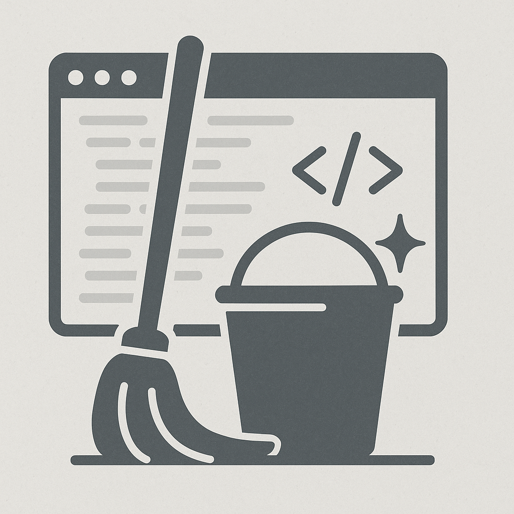
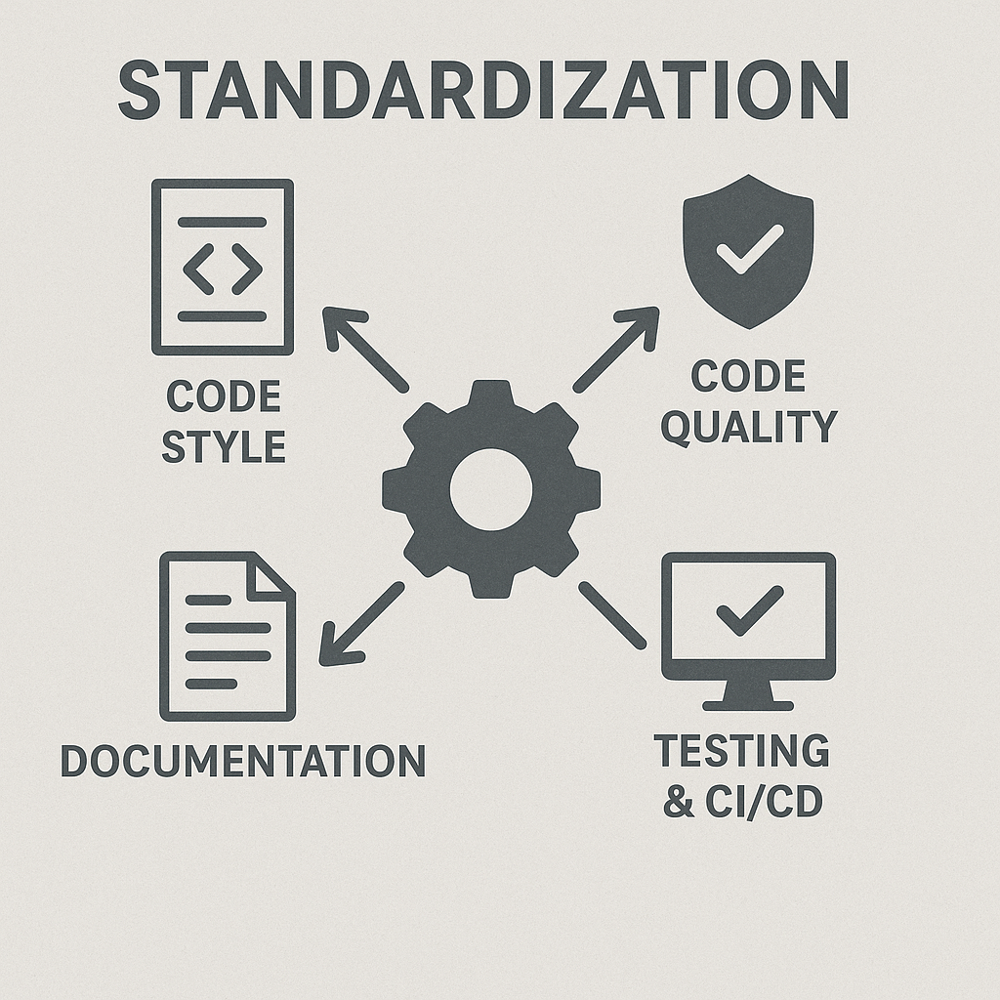
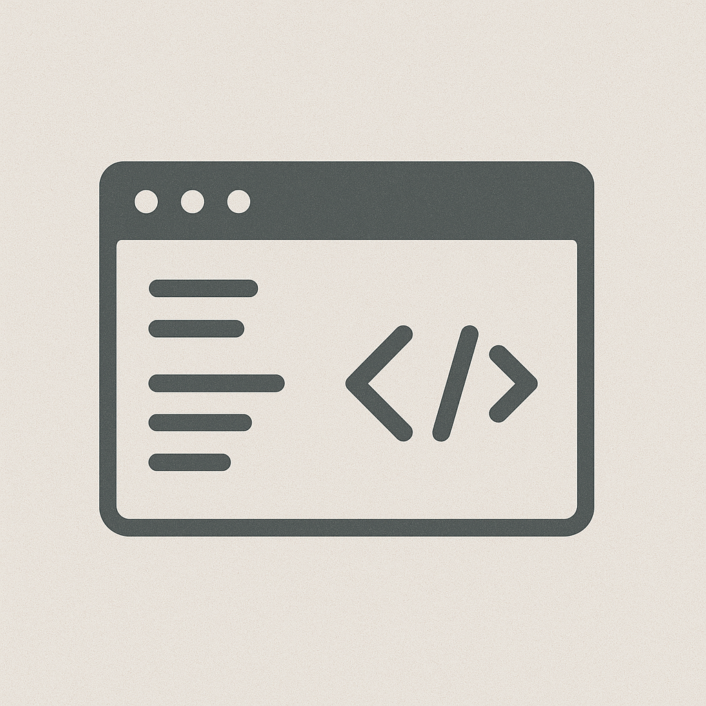

class: center, middle, inverse

# betadots GmbH - @rwaffen

# Why clean code matters?

???

* Use `???` to add notes
* Use `---` to separate slides
* Use `count: false` to disable slide numbering
* Use `background-image: url(image.png)` to set a background image

---

## $ whoami

* Robert Waffen
* @rwaffen on GitHub/Fosstodon
* Puppet Contributor since ~2013
* Merging stuff on [Vox Pupuli](https://voxpupuli.org/) (Puppet Community) since 2022
* Vox Pupuli Project Management Committee member
* Senior IT Automation Consultant at [betadots](https://betadots.de/)
* Gaming on Linux since 2020

???

* who has seen this picture before because I reviewed/merged your pull request?

---

## Why clean code matters?

* Imagine the code base is like your house
* Having non standardized stairs sucks?
* Having standards helps everyone
* You want to keep it clean and organized
* Readability is key
* Don't let junk accumulate
* Regularly refactor and tidy up

???

---

## Standardize what?

* Code style (indentation, spacing, naming conventions)
* Code quality (linting, formatting, etc.)
* Directory structure
* Documentation (README, CONTRIBUTING, etc.)
* Testing (unit tests, integration tests, etc.)
* CI/CD pipelines
* Commit signing

???

---

## Benefits of Standardization

* Improved collaboration
* Easier onboarding of new contributors
* Reduced cognitive load
* Increased code quality
* Faster development cycles

???

---

## Code style

* Consistent indentation (e.g., 2 spaces vs. 4 spaces)
* Naming conventions (e.g., camelCase vs. snake_case)
* File organization (e.g., where to put tests, docs, etc.)
* No trailing whitespace or empty lines

???

---

## Code quality

* Use linters and formatters
* Write tests for your code
* Keep dependencies up to date
* Perform code reviews

???

---

## Directory structure

* Keep a logical and consistent directory structure
* Use clear and descriptive names for files and directories
* Group related files together
* Separate different types of files (e.g., source code, tests, documentation)

???

---

## Documentation

* Keep documentation up to date
* Use clear and concise language
* Provide examples and use cases
* Include installation and usage instructions

???

---

## Testing

* Write unit tests for your code
* Use integration tests to verify interactions between components
* Keep tests up to date with code changes

???

---

## CI/CD

* Automate your build and deployment processes
* Use continuous integration (CI) to run tests and checks on every commit
* Use continuous deployment (CD) to automatically deploy changes to production
* Monitor your CI/CD pipelines for failures and bottlenecks

???

---

## Why sign commits?

* Establishes trust in the codebase
* Provides a clear audit trail
* Helps identify the author of changes
* Prevents tampering with commit history

???

---

## How to argument all this to your colleagues?

* Emphasize the benefits of clean code and standardization
* Share examples of improved collaboration and code quality
* Highlight the importance of maintainability and readability
* Encourage a culture of continuous improvement
* Provide resources and tools to help with implementation

???

---

## Linter examples

* [EditorConfig](https://editorconfig.org/) for maintaining consistent coding styles
* [ESLint](https://eslint.org/) for JavaScript
* [Flake8](https://flake8.pycqa.org/en/latest/) for Python
* [Rubocop](https://rubocop.org/) for Ruby
* [ShellCheck](https://www.shellcheck.net/) for shell scripts
* [Puppet Lint](https://puppet-lint.com/) for Puppet
* [Markdownlint](https://github.com/DavidAnson/markdownlint) for Markdown

???
